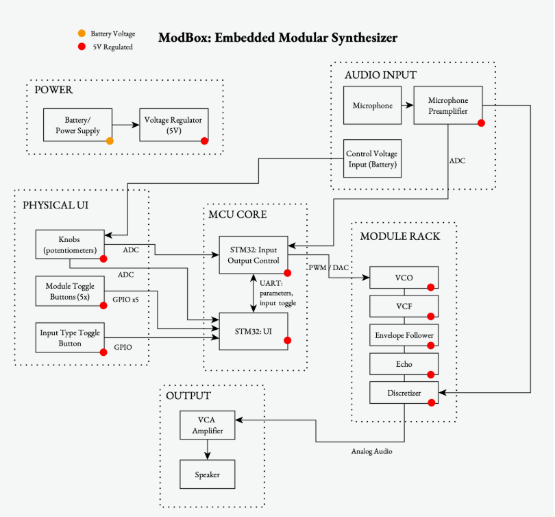
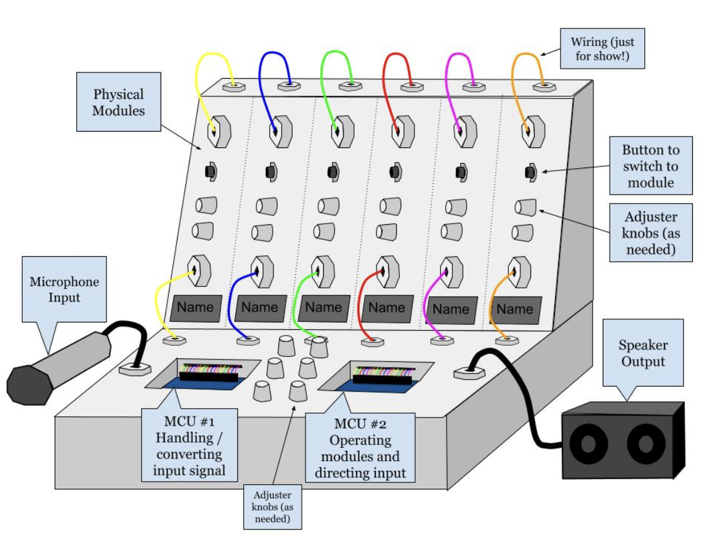
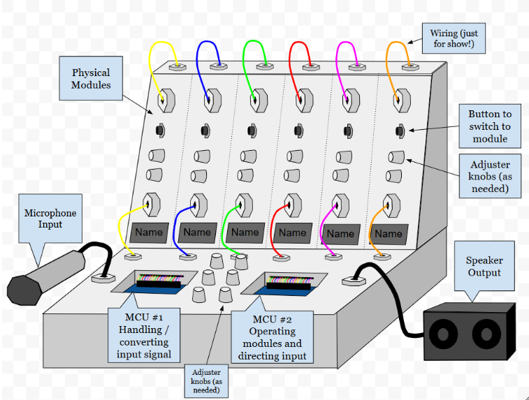

# Final Project

**Team Number: 13**

**Team Name: ModBox**

| Team Member Name  | Email Address           |
| ----------------- | ----------------------- |
| Bhavya Surapaneni | bhavyasp@seas.upenn.edu |
| Katya Mazurenko   | kmazu@seas.upenn.edu    |
| Sarah Liao        | sarahl28@seas.upenn.edu |
| Mary Mbuzi        | mmbuzi28@seas.upenn.edu |

**GitHub Repository URL: [https://github.com/upenn-embedded/final-project-s26-t13.git]([https://github.com/upenn-embedded/final-project-s26-t13.git]())**

**GitHub Pages Website URL:** [for final submission]*

## Final Project Proposal

### 1. Abstract

For our final project, we are building a completely embedded modular synthesizer. Modular synthesizers use different modules to produce signals that are usually analog, and you are able to modulate the signal in different ways by altering the connections between modules such as amplifiers, filters, oscillators, shapers. We want to take this concept and make it embedded, using both firmware and hardware to create an embedded modular synth box. The actual modules will be analogue, built with components like capacitors, resistors, and transistors to get a more authentic, imperfect sound, but the operational features like buttons and knobs for each module will operate as per our firmware, defining the order that modules operate and their relative intensity. We will have two input mechanisms that can be toggled between with a button - the first is inputting a control voltage that can then be modulated into a sound wave, and the second is inputting live audio that will be discretized into a voltage that can be similarly modulated. All of these components will be in a clean form factor that will operate as an instrument that can be easily used for electronic music creation.

### 2. Motivation

Our motivation for this project is a general interest in synthesizers and modular synthesis, and curiosity to see how they translate to the embedded world. It’s pretty normal to create basic modular synthesizers with MCUs, but we want to take it to the next level and add more features to make it a nice combination of the analog and digital worlds.

### 3. System Block Diagram

### 4. Design Sketches

### 5. Software Requirements Specification (SRS)

**5.1 Definitions, Abbreviations**

Audio sampling and processing:

* Taking input from a microphone, it will amplify and shift the signal to fit the ADC. The audio MCU samples the microphone signal so that a number represents the amplitude of the voice waveform at that moment. We can then monitor input amplitude for control and diagnostic purposes.

Module routing:

* Using buttons and knobs, the system will allow users to enable, disable, or adjust the modules parameters in real time without interrupting audio playback.
* The software should detect button presses using interrupts which will enable or disable audio processing modules. It should also include button debouncing.
* It will also read analog knob positions using the MCU ADC so the software can change the strength or intensity of a given module
* Validation methods could include adjusting modules while the audio is playing continuously and ensuring they are shaping the audio in the way they are intended and not causing audio dropouts.

MCU communication:

* The two MCUs will communicate with each other via I2C. MCU 1 will read the knobs (potentiometers) using ADC, detect button presses using interrupts, determine which module is active or bypassed, and send control values to the second MCU 2. MCU 2 will denerate control voltages for modules, control analog switches that enable/bypass modules, adjust effect intensity based on knob values, monitor audio levels using ADC if needed, and control any timing-related effects (like echo).

Output audio:

* We will then output the audio signal through a speaker. We can monitor the output signal level using the MCU ADC to ensure the signal remains within the allowable operating range. This will prevent clipping or excessive signal levels.

**5.2 Functionality**

| ID     | Description                                                                                                                            |
| ------ | -------------------------------------------------------------------------------------------------------------------------------------- |
| SRS-01 | The buttons that control the input voltage and inputing live audio will use interrupts and require software debouncing.                |
| SRS-02 | The two MCUs must communicate using I2C where MCU1 sends updates to MCU2 when values change and MCU2 receives data using an interrupt. |
| SRS-03 | The microphone should intake audio when a button is pressed and the input signal should be monitored using an ADC.                     |
| SRS-04 | The ouput audio will also be monitred using the ADC to detect distortion or clipping.                                                  |

### 6. Hardware Requirements Specification (HRS)

**6.1 Definitions, Abbreviations**

Microphone:

* Since the audio input from the microphone won’t provide the best signal quality, we will need to amplify and filter the signal through hardware.

Modular signal processing:

* The modules such as ring modulator, voltage controlled filter, envelope follower, echo, and wave folder will all be hardware which are made of inductors, capacitors, resistors, transistors and op amps.
* The ring modulator: multiples the input audio signal with a carrier oscillator signal to produce sum and difference frequency components, creating a modulation effect
* Voltage controlled filter: attenuate frequencies above a configurable cutoff frequency while allowing lower frequencies to pass
* Envelope follower: detect the amplitude envelope of the incoming audio signal and produce a corresponding control voltage proportional to the signal amplitude
* Echo: reproduce delayed versions of the input signal to create a repeating echo effect
* Wave folder: "reflects" the waveform back on itself to introduce additional harmonic sound

Module routing (oscillator, filter, amplifier):

* Some module routing requires a specific sequence of events: the oscillator produces the periodic waveform, the filter shapes the tone of sound, and the amplifier amplifies the sound. So, hardware requirements might include physically routing some modules to create a desired output.

Audio output:

* We will likely require an audio buffer to stabilize and amplify the signal and to drive it so it can play through a speaker.

**

**6.2 Functionality**

| ID     | Description                                                                                                                                    |
| ------ | ---------------------------------------------------------------------------------------------------------------------------------------------- |
| HRS-01 | A microphone will intake live audio and play through the modules.                                                                              |
| HRS-02 | The modules will be hardware based and made up of passive components.                                                                          |
| HRS-03 | Some manual routing will probably be required, so connecting certain modules through hardware will be needed.                                  |
| HRS-04 | The buttons and knobs will turn a module or adjust the input voltage which changed the intensity of the module.                                |
| HRS-05 | The audio will output threough a speaker which will require an audio buffer/amplifer and audio amplifer to drive the signal through a speaker. |

### 7. Bill of Materials (BOM)

Link: [https://docs.google.com/spreadsheets/d/1FfpUyTM7GOHpUId-kbmIrWoPR1Q2QyKV87Wz2lGQ6IE/edit?usp=sharing](https://docs.google.com/spreadsheets/d/1FfpUyTM7GOHpUId-kbmIrWoPR1Q2QyKV87Wz2lGQ6IE/edit?usp=sharing)

### 8. Final Demo Goals

For our final demo of the project, we plan on showing the different modules that the synthesizer does and how it affects the output of sound. We also plan to do a live demo of inputting audio with someone’s voice and playing around with the synthesizer to create and shape cool new sounds. There shouldn’t be too many constraints here since it doesn’t actually attach to anyone, but we need to make sure the MCUs are supplied with power so the device operates, likely with batteries.

### 9. Sprint Planning

| Milestone  | Functionality Achieved                                                                                             | Distribution of Work |
| ---------- | ------------------------------------------------------------------------------------------------------------------ | -------------------- |
| Sprint #1  | build an input module for the voice input and for the control voltage input, successfully demo on the oscilloscope |                      |
| Sprint #2  | have 2-3 successful modules (on top of input modules), demo on oscilloscope                                        |                      |
| MVP Demo   | have all modules complete, demo with oscilloscope and speaker.                                                     |                      |
| Final Demo | have a completed cad model of the design box, along with fully functioning device.                                 |                      |

**This is the end of the Project Proposal section. The remaining sections will be filled out based on the milestone schedule.**

## Sprint Review #1

### Last week's progress

So far, we have met with Andrea, our project manager, and figured out our situation in terms of parts. We found that despite needing a microphone and preamplifier, Detkin actually had the parts that we needed so we do not need to order anything a la carte for this project. We also decided to shift our microcontrollers to the STM32s instead of the ATMega328-PB, since the STM32 is much better suited for ADC applications and our project is largely using ADC. We also decided to shift our communication protocol between our microcontrollers from I2C to I2S, as per Andrea's guidance, since I2S is much better suited for high-quality audio.

### Current state of project

As of the beginning of our first lab period designated for the final project, we do not have any code or hardware written. Our plan is to create our CircuitLab schematic for all of the connections between our physical hardware and module creation. We will also confirm all of our parts. We plan to start on at least some portions of the hardware connections (input, output, 1 module (VCO)), and get a decent start on our firmware. At the very least, figure out a structure for our code, learn the STM registers better so we can code more efficiently, and get some files started with pseudocode for what they need to do. At the end of the lab section, we will include our schematic and indicate which portions we started for hardware.

GOALS:

* Circuitlab schematic
* Confirm all parts
* Hardware: Input, Output, VCO Module
* Firmware: Learn registers, file structure w/ pseudocode

As of the end of the lab period:

### Next week's plan

## Sprint Review #2

### Last week's progress

### Current state of project

### Next week's plan

## MVP Demo

1. Hardware Implementation & System Diagram 
Our hardware implementation centers around a modular rack where audio signals are processed through several custom modules: VCO, VCF, VCA, Echo, Discretizer, and an Envelope Generator.
We’ve made one significant update to our original design: we are now using STM32s as our MCU Core instead of the ATmega328P to better handle the processing requirements. Currently, our Power and Physical UI systems are fully operational. While the Audio Input is still in development, we’ve established that the microphone signal will require dedicated hardware amplification and filtering to ensure high signal quality for the synthesizer.

 

2. Firmware Implementation & Drivers
For the firmware, we are developing application logic on the STM32 to handle the high-speed conversion and routing of signals. We’ve written critical drivers for the ADC to read our physical UI knobs and the GPIO for our five module toggle buttons. The core logic currently manages the switching between hardware modules and the basic operation of the VCO and VCA, which are already functional. Implementation of Envelope Follower, Echo and Discretizer is done completely digitally.

3. Device Demonstration
In this demo, you can see the core functionality of our VCO and VCA. We can manipulate the tone using the physical potentiometers on our UI. Even though the microphone input isn't finalized, the internal signal routing through the Module Rack is working, allowing us to demonstrate the basic analog audio path through to the speaker. 

4. Software Requirements Specification (SRS)
We have achieved our SRS goals regarding real-time user input. Data collected from our potentiometer ADC tests shows stable parameter control with minimal latency, ensuring that the 'ModBox' feels like a responsive instrument. Our next software milestone is finishing the microphone input.

5. Hardware Requirements Specification (HRS)
On the hardware side, we’ve met most of our requirements for the Output Amplifier and Power Regulation. We verified the output buffer’s ability to stabilize the signal for the speaker. We are using a boost converter in our final output stage, the VCA.

6. Remaining Elements (Mechanical & UI)
Our final vision includes a custom mechanical casework that mimics a classic modular synth aesthetic. We will feature 'patch cable' wiring for visual effect and a structured interface for the module toggle buttons and adjuster knobs. Something similar to what we have below, though the UI will probably look a bit different.

7. Risks & De-risking Plan
Each time we add something we deal with amplification and noise issues. Adding one more element can break the rest of the circuits and code.
One of the riskiest parts remaining is the Microphone Input. Because the raw electret signal is so weak and noisy, it could easily ruin the modular processing. To de-risk this, we are prioritizing the hardware filter/amplifier circuit this week to ensure we have a clean signal before Demo Day next week.

## Final Report

Don't forget to make the GitHub pages public website!
If you’ve never made a GitHub pages website before, you can follow this webpage (though, substitute your final project repository for the GitHub username one in the quickstart guide):  [https://docs.github.com/en/pages/quickstart](https://docs.github.com/en/pages/quickstart)

### 1. Video

### 2. Images

### 3. Results

#### 3.1 Software Requirements Specification (SRS) Results

| ID     | Description                                                                                               | Validation Outcome                                                                          |
| ------ | --------------------------------------------------------------------------------------------------------- | ------------------------------------------------------------------------------------------- |
| SRS-01 | The IMU 3-axis acceleration will be measured with 16-bit depth every 100 milliseconds +/-10 milliseconds. | Confirmed, logged output from the MCU is saved to "validation" folder in GitHub repository. |

#### 3.2 Hardware Requirements Specification (HRS) Results

| ID     | Description                                                                                                                        | Validation Outcome                                                                                                      |
| ------ | ---------------------------------------------------------------------------------------------------------------------------------- | ----------------------------------------------------------------------------------------------------------------------- |
| HRS-01 | A distance sensor shall be used for obstacle detection. The sensor shall detect obstacles at a maximum distance of at least 10 cm. | Confirmed, sensed obstacles up to 15cm. Video in "validation" folder, shows tape measure and logged output to terminal. |
|        |                                                                                                                                    |                                                                                                                         |

### 4. Conclusion

## References
