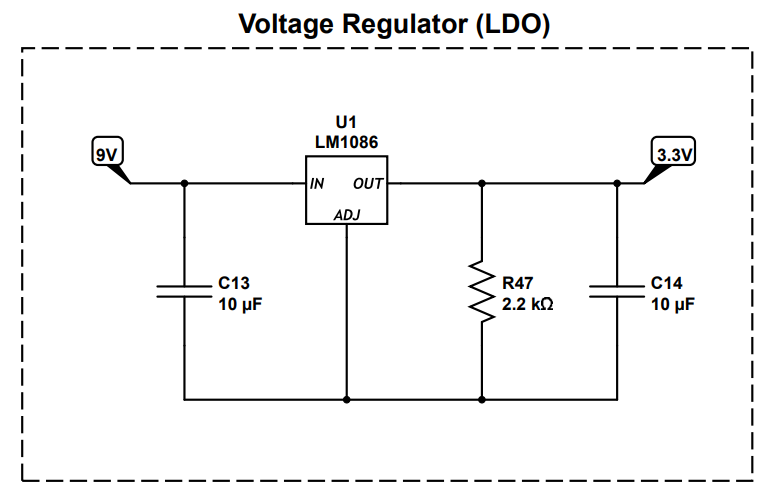
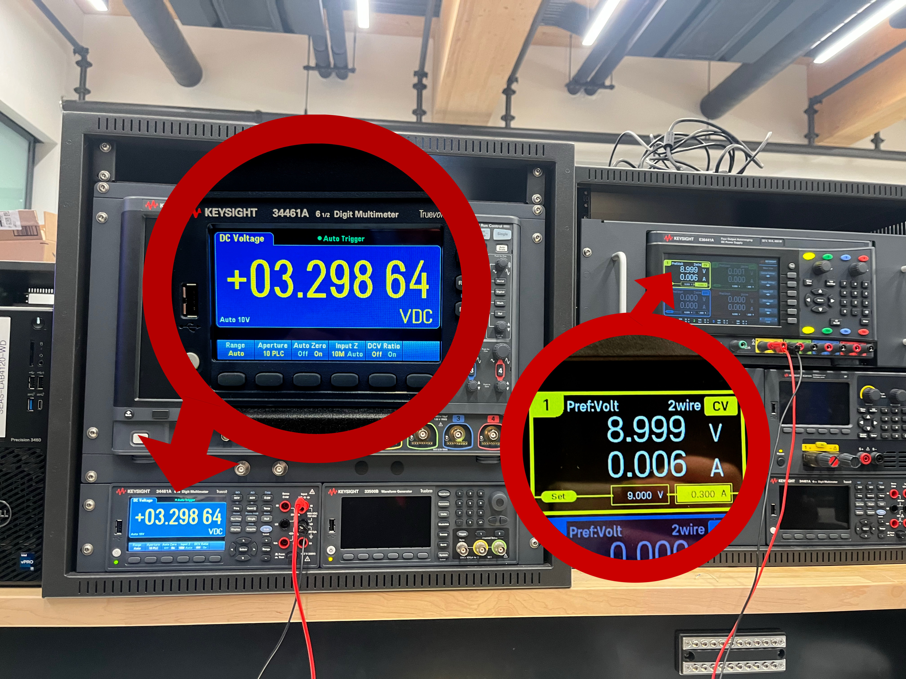

# ModBox - Video Demo

  <iframe
    src="https://www.youtube.com/embed/n3K_fZDvINs"
    title="Demo video player"
    style="position: absolute; top: 0; left: 0; width: 100%; height: 100%;"
    frameborder="0"
    allowfullscreen>
  </iframe>

In this demo, we will give an overview of the design process and a demostration of ModBox's user interface.

---

# Images

  

  

#### **400x400 Image:**

---

# Software Requirements Specification (SRS)

#### **Features:**

* SRS 01: ADC Input - we use the ADC input pins to track the potentiometer-based voltage divider output (the user’s control knobs).
* SRS 02: Interrupts - we use interrupts to track the user’s button presses when they want to switch modes or routing.
* SRS 03: UART Communication between MCUs - The two STM32 nucleos communicate with each other via UART. One MCU processes and tracks the user input and modes of operation and sends them to the second MCU via UART
* SRS 04: PWM Output - We generate a PWM output using a timer with frequency of ___ equation ____ to power our buck converter.
* SRS 05: Signal routing - Module routing requires a specific sequence of events: the oscillator produces the periodic waveform, the different modules (digital and analog) shape the tone of sound, and the analog amplifier is the final stage before the speaker. Because of this, we route our input signal through the STM32 __ pin(s) so that it can apply / route to modules.
* SRS 06: Envelope Generator - The envelope generator is one of our digital modules. We digitally envelope our signal
* SRS 07: LCD screen - we use I2C to control an LCD screen that display's the user's selected sound modes.

#### **Validation:**

  <iframe
    src="https://www.youtube.com/embed/eALjC2jrxNI"
    title="Demo video player"
    style="position: absolute; top: 0; left: 0; width: 100%; height: 100%;"
    frameborder="0"
    allowfullscreen>
  </iframe>

**UART Validation:** In this demo you can see our two MCUs communicating via UART. One MCU is tracking input ADC values and button interrupts and send all updates to the second MCU which implements those changes.

**ADC Demo**

Video

Caption

#### **Comments:**

We originally chose STMs as our MCU for their I2S capabilities, but we really struggled with the implementation and eventually had to give up for the sake of our MVP Demo. Despite the switch up, we were able to successfully implement UART communication instead of I2S on top of learning how to use a completely new MCU.

---

# Hardware Requirements Specification (HRS)

#### **Features:**

* HRS 01: STM32 Nucleo - We worked with two STM32 Nucleos, one for handling user input and one for routing and generating the sound signal based on the user's actions.
* HRS 02: Digital User Interface - 5 push buttons representing an input type switch option and 4 presets and 5 potentiometers representing __. 1 potentiometer is the analog control for the VCO.
  
* HRS 04: Voltage Controlled Oscillator (VCO) - the voltage controlled oscillator is an analog oscillator that outputs either a triangle waveform or a square waveform determined by V_expo (ADC output, between 0 and 3.3V). It is built with Detkin resistors, capacitors, LM358 Op Amps, and BC548 BJTs.
  
* HRS 05: Voltage Controlled Filter (VCF) - One of our modules is a Voltage controlled low pass filter. By turning the potentiometer knobs, the user can adjust the gain and cutoff frequency of the amplifier.
* HRS 06: Output Stage - We use a TPA2012 Amplifier to drive our output signal through the speaker. Our output speaker (TBD) is an 8Ohm Speaker so it requires a very low output impedance from the amplifier to achieve maximum output. We used the control switches on the amplifier to give our signal a gain of 6dB so we could hear it clearly. We use 3.3V to power the amplifier and ground the SDL pin to turn off the left output.
  
* HRS 07: Voltage Regulator (LDO) - We use a LM1086 LDO to step down our 9V to ~3.3V so that it is safe to be imputed into our MCU.
  

## **Validation:**

**LDO Validation:** The input voltage (9V) is on the yellow power supply, the shifted output signal (3.3V) is on the multimeter.

  <iframe
    src="https://www.youtube.com/embed/JtyX_r8pcOk"
    title="Demo video player"
    style="position: absolute; top: 0; left: 0; width: 100%; height: 100%;"
    frameborder="0"
    allowfullscreen>
  </iframe>

**Speaker Amplifier Validation:** This video demonstrates the speaker producing sound and its gain being varied by the switches on the speaker amplifier.

#### **Comments:**

With the analog side of our project, we faced major challenges with noise and impedance transfer. A lot of times our circuits worked fine on their own, but would stop functioning upon integration with the rest of the build. We had to play around a lot with filters and buffers, and not everything worked in the end. As a result, we are super proud of our modules that do successfully produce sound, whether through analog or digital routing. It was no easy feat!

---

# Reflection

**Bhavya:**

**Sarah:**

**Mary:**

Working on ModBox was a challenging and rewarding experience of my time in ESE 3500. The project had its bumps, I designed a filter for our original Max4466 mic only to find the signal was still too noisy, which led me to swap to a different mic entirely, that was the Max9814 mic. That whole process taught me more about signal quality and practical circuit troubleshooting. I also attempted to build an oscillator from scratch that didn't work when tested, which, while frustrating, taught me just how sensitive analog circuits are to component tolerances. On top of that, I helped assemble the physical enclosure that houses everything, which made the project feel like a real finished instrument rather than a breadboard prototype. What I'm most proud of is how the full system came together, the analog modules, the STM32-driven control interface, and the physical box all working in concert as something you could actually play. If I could do anything differently, I would have evaluated the microphone hardware much earlier to avoid investing time in a filter that ultimately couldn't fix the problem. The next step for this project would be revisiting the oscillator design, refining the microphone input for cleaner live audio, and expanding the module library to give the synthesizer even more ways to shape and transform sound.

**Katya:**

During this project, the newest thing I challenged myself to learn was how to design, CAD, and laser cut our box. Bhavya and two of my MEAM friends were very helpful throughout the process and I couldn’t have done it without them!  I feel that learning this skill will open a lot of new opportunities for me to prototype or explore more versatile paths. I also worked on designing two analog modules that were unfortunately not implemented due to them not working reliably by the time necessary. One was a Voltage Controlled Amplifier (VCA)- At the time, we were having issues with our TPA2012 providing too much gain and our output being very loud. As a result, it led us to consider building a VCA that could reduce the gain on our signal. Due to lack of documentation, I decided to design one myself by making a CD amplifier with a transistor in the deep triode region as a load (using a boost converter to operate the triode-transistor). I was able to vary the gain by varying the input voltage to the boost converter when we used the frequency generator as input, but unfortunately it failed when we routed the actual signal as input from the VCO. Also, because human hearing is on the decibel scale, it was difficult to discern the changes in sound amplitude that we could see on the oscilloscope, so the amplifier was pretty pointless from a user perspective. Still, I was super proud of myself that I managed to theorize and design something successfully based on previous coursework. I also worked on selecting the parts for the output & microphone stage. While looking at different output and input amps, I did some research into I2S as STM was heavily recommended to us because of it. Plus I got far more comfortable reading and comparing datasheets of different parts to decide what was best for us. Lastly, while I was not the main person working on code, I still got to strengthen a lot of the core concepts we learned in class-  timers, interrupts, serial communication, and ADC- by seeing them applied to a new controller.

---

# README (Previous Updates)

**Proposal**

1. Abstract

   For our final project, we are building a completely embedded modular synthesizer. Modular synthesizers use different modules to produce signals that are usually analog, and you are able to modulate the signal in different ways by altering the connections between modules such as amplifiers, filters, oscillators, shapers. We want to take this concept and make it embedded, using both firmware and hardware to create an embedded modular synth box. The actual modules will be analogue, built with components like capacitors, resistors, and transistors to get a more authentic, imperfect sound, but the operational features like buttons and knobs for each module will operate as per our firmware, defining the order that modules operate and their relative intensity. We will have two input mechanisms that can be toggled between with a button - the first is inputting a control voltage that can then be modulated into a sound wave, and the second is inputting live audio that will be discretized into a voltage that can be similarly modulated. All of these components will be in a clean form factor that will operate as an instrument that can be easily used for electronic music creation.
2. Motivation

   Our motivation for this project is a general interest in synthesizers and modular synthesis, and curiosity to see how they translate to the embedded world. It’s pretty normal to create basic modular synthesizers with MCUs, but we want to take it to the next level and add more features to make it a nice combination of the analog and digital worlds.
3. System Block Diagram

   image
4. Design Sketches

   image
5. Software Requirements Specification (SRS)

Audio sampling and processing:

* Taking input from a microphone, it will amplify and shift the signal to fit the ADC. The audio MCU samples the microphone signal so that a number represents the amplitude of the voice waveform at that moment. We can then monitor input amplitude for control and diagnostic purposes.

Module routing:

* Using buttons and knobs, the system will allow users to enable, disable, or adjust the modules parameters in real time without interrupting audio playback.
* The software should detect button presses using interrupts which will enable or disable audio processing modules. It should also include button debouncing.
* It will also read analog knob positions using the MCU ADC so the software can change the strength or intensity of a given module
* Validation methods could include adjusting modules while the audio is playing continuously and ensuring they are shaping the audio in the way they are intended and not causing audio dropouts.

MCU communication:

* The two MCUs will communicate with each other via I2C. MCU 1 will read the knobs (potentiometers) using ADC, detect button presses using interrupts, determine which module is active or bypassed, and send control values to the second MCU 2. MCU 2 will denerate control voltages for modules, control analog switches that enable/bypass modules, adjust effect intensity based on knob values, monitor audio levels using ADC if needed, and control any timing-related effects (like echo).

Output audio:

* We will then output the audio signal through a speaker. We can monitor the output signal level using the MCU ADC to ensure the signal remains within the allowable operating range. This will prevent clipping or excessive signal levels.

Functionality:

| ID     | Description                                                                                                                            |
| ------ | -------------------------------------------------------------------------------------------------------------------------------------- |
| SRS-01 | The buttons that control the input voltage and inputing live audio will use interrupts and require software debouncing.                |
| SRS-02 | The two MCUs must communicate using I2C where MCU1 sends updates to MCU2 when values change and MCU2 receives data using an interrupt. |
| SRS-03 | The microphone should intake audio when a button is pressed and the input signal should be monitored using an ADC.                     |
| SRS-04 | The ouput audio will also be monitred using the ADC to detect distortion or clipping.                                                  |

6. Hardware Requirements Specification (HRS)

Microphone:

* Since the audio input from the microphone won’t provide the best signal quality, we will need to amplify and filter the signal through hardware.

Modular signal processing:

* The modules such as ring modulator, voltage controlled filter, envelope follower, echo, and wave folder will all be hardware which are made of inductors, capacitors, resistors, transistors and op amps.
* The ring modulator: multiples the input audio signal with a carrier oscillator signal to produce sum and difference frequency components, creating a modulation effect
* Voltage controlled filter: attenuate frequencies above a configurable cutoff frequency while allowing lower frequencies to pass
* Envelope follower: detect the amplitude envelope of the incoming audio signal and produce a corresponding control voltage proportional to the signal amplitude
* Echo: reproduce delayed versions of the input signal to create a repeating echo effect
* Wave folder: "reflects" the waveform back on itself to introduce additional harmonic sound

Module routing (oscillator, filter, amplifier):

* Some module routing requires a specific sequence of events: the oscillator produces the periodic waveform, the filter shapes the tone of sound, and the amplifier amplifies the sound. So, hardware requirements might include physically routing some modules to create a desired output.

Audio output:

* We will likely require an audio buffer to stabilize and amplify the signal and to drive it so it can play through a speaker.

Functionality:

| ID     | Description                                                                                                                                    |
| ------ | ---------------------------------------------------------------------------------------------------------------------------------------------- |
| HRS-01 | A microphone will intake live audio and play through the modules.                                                                              |
| HRS-02 | The modules will be hardware based and made up of passive components.                                                                          |
| HRS-03 | Some manual routing will probably be required, so connecting certain modules through hardware will be needed.                                  |
| HRS-04 | The buttons and knobs will turn a module or adjust the input voltage which changed the intensity of the module.                                |
| HRS-05 | The audio will output threough a speaker which will require an audio buffer/amplifer and audio amplifer to drive the signal through a speaker. |

7. Bill of Materials (BOM)

* Link: [https://docs.google.com/spreadsheets/d/1FfpUyTM7GOHpUId-kbmIrWoPR1Q2QyKV87Wz2lGQ6IE/edit?usp=sharing](https://docs.google.com/spreadsheets/d/1FfpUyTM7GOHpUId-kbmIrWoPR1Q2QyKV87Wz2lGQ6IE/edit?usp=sharing)

8. Final Demo Goals

* For our final demo of the project, we plan on showing the different modules that the synthesizer does and how it affects the output of sound. We also plan to do a live demo of inputting audio with someone’s voice and playing around with the synthesizer to create and shape cool new sounds. There shouldn’t be too many constraints here since it doesn’t actually attach to anyone, but we need to make sure the MCUs are supplied with power so the device operates, likely with batteries.
