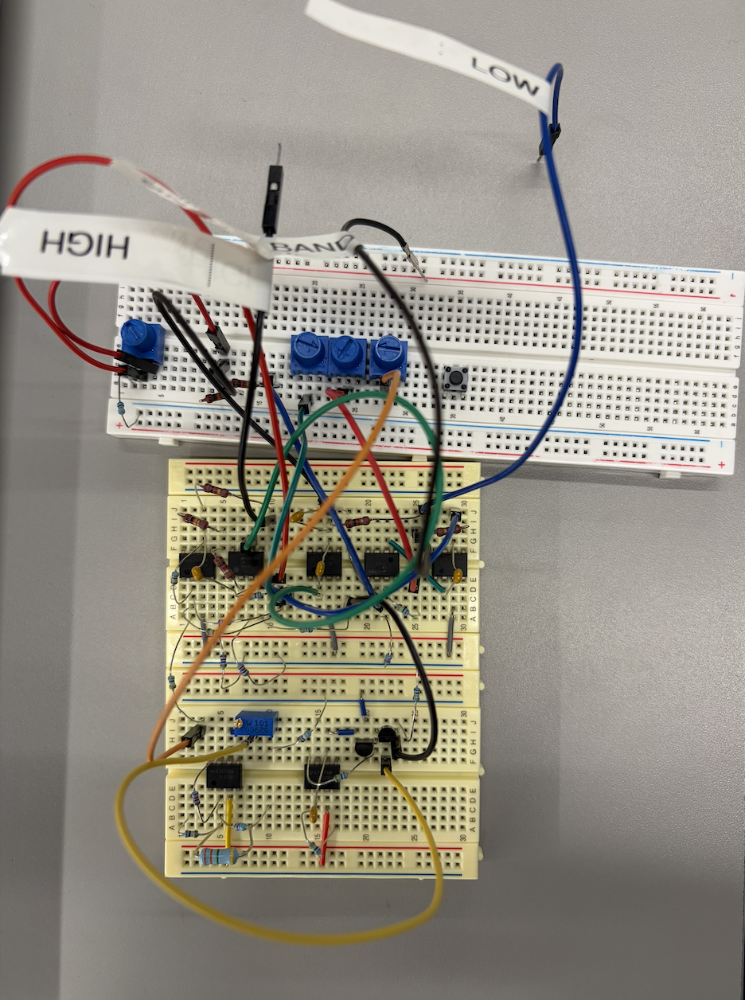
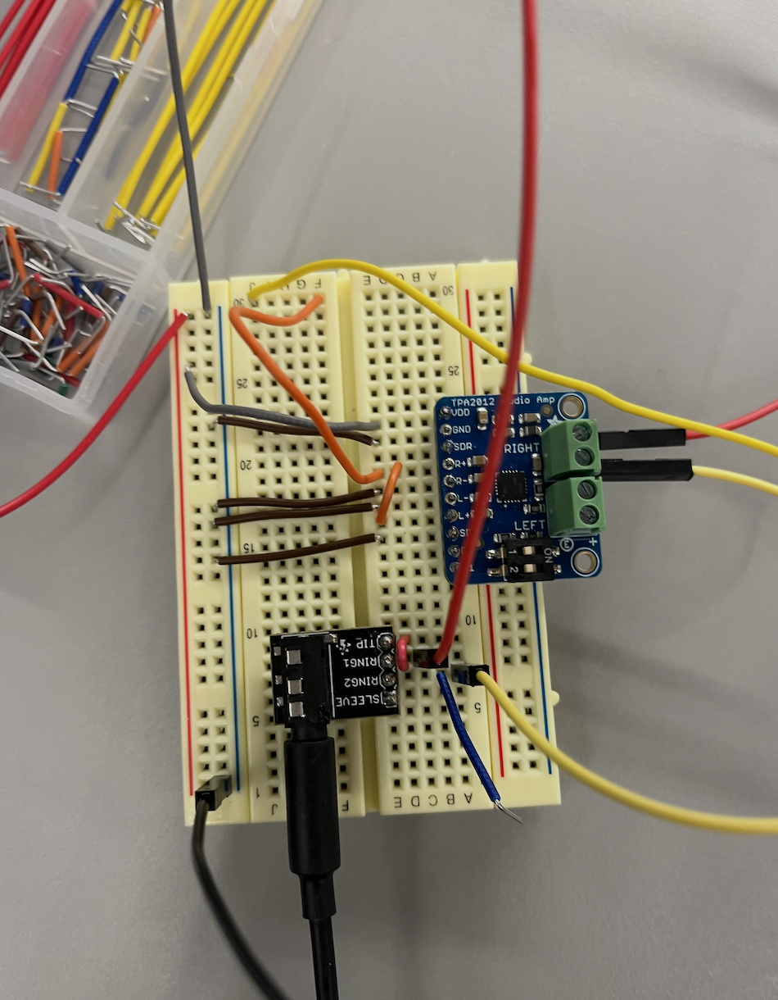
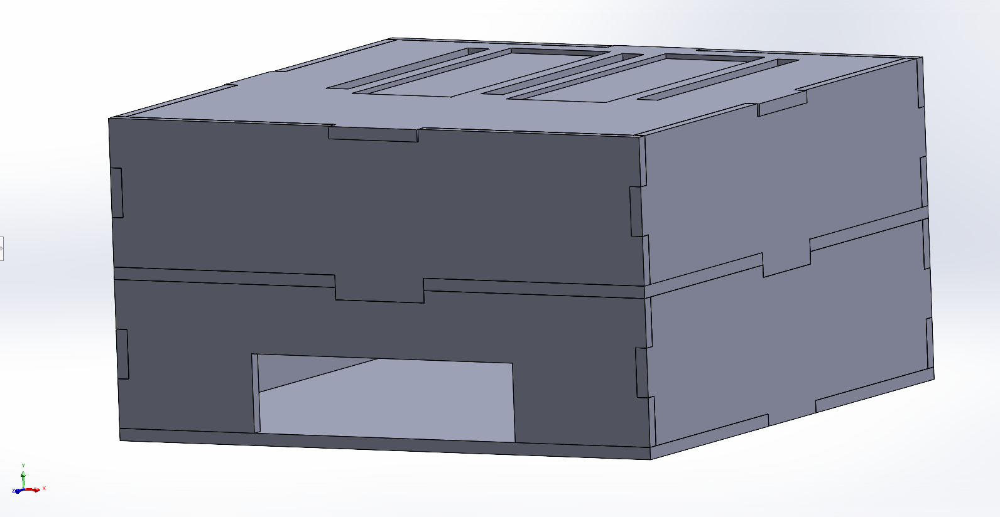
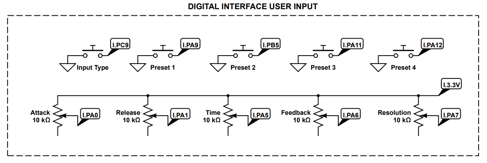
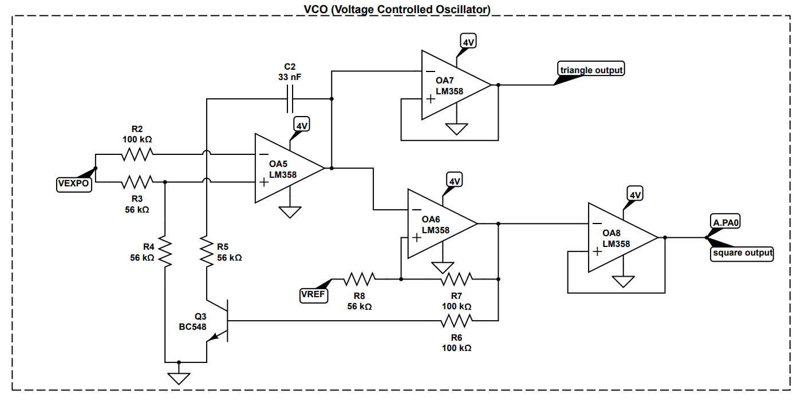
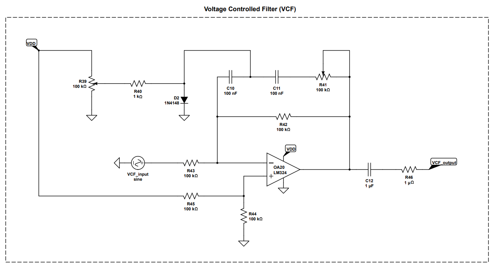
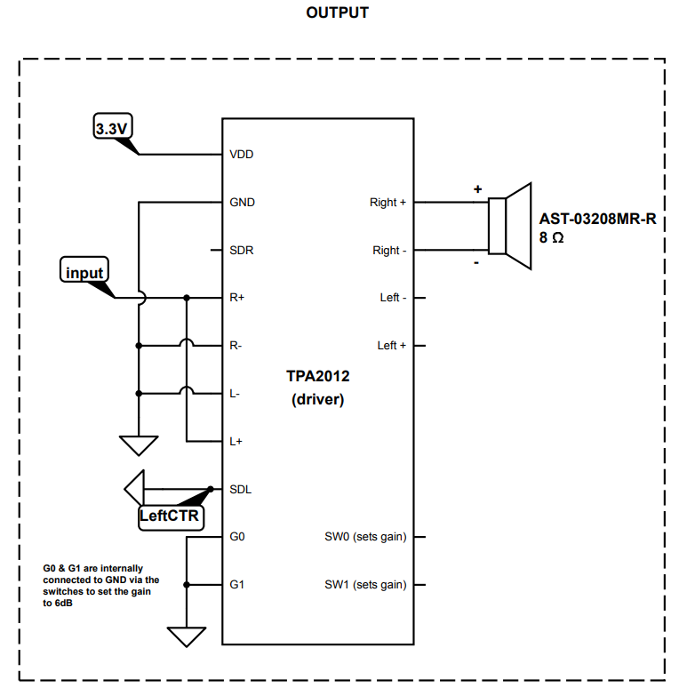
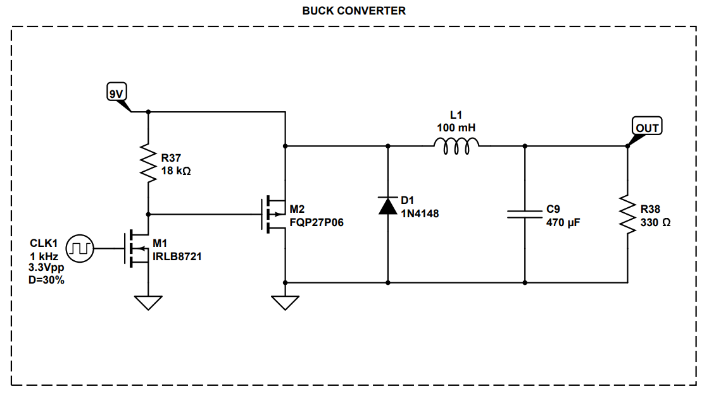
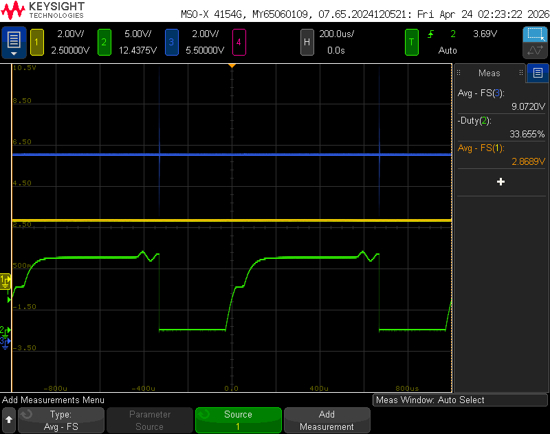

# Video Demo

  <iframe
    src="https://www.youtube.com/embed/n3K_fZDvINs"
    title="Demo video player"
    style="position: absolute; top: 0; left: 0; width: 100%; height: 100%;"
    frameborder="0"
    allowfullscreen>
  </iframe>

In this demo, we will give an overview of the design process and a demostration of ModBox's user interface.

---

# Images

  

  

#### **400x400 Image:**

---

# SRS

#### **Features:**

* SRS 01: ADC Input - we use the ADC input pins to track the potentiometer-based voltage divider output (the user’s control knobs).
* SRS 02: Interrupts - we use interrupts to track the user’s button presses when they want to switch modes or routing.
* SRS 03: UART Communication between MCUs - The two STM32 nucleos communicate with each other via UART. One MCU processes and tracks the user input and modes of operation and sends them to the second MCU via UART
* SRS 04: PWM Output - We generate a PWM output using a timer with frequency of ___ equation ____ to power our buck converter.
* SRS 05: Signal routing - Module routing requires a specific sequence of events: the oscillator produces the periodic waveform, the different modules (digital and analog) shape the tone of sound, and the analog amplifier is the final stage before the speaker. Because of this, we route our input signal through the STM32 __ pin(s) so that it can apply / route to modules.
* SRS 06: Envelope Generator - The envelope generator is one of our digital modules. We digitally envelope our signal
* SRS 07: LCD screen - we use I2C to control an LCD screen that display's the user's selected sound modes.

#### **Validation:**

  <iframe
    src="https://www.youtube.com/embed/eALjC2jrxNI"
    title="Demo video player"
    style="position: absolute; top: 0; left: 0; width: 100%; height: 100%;"
    frameborder="0"
    allowfullscreen>
  </iframe>

Caption

**ADC Demo**

Video

Caption

#### **Comments:**

We originally chose STMs as our MCU for their I2S capabilities, but we really struggled with the implementation and eventually had to give up for the sake of our MVP Demo. Despite the switch up, we were able to successfully implement UART communication instead of I2S on top of learning how to use a completely new MCU. 

---

# HRS

#### **Features:**

* RS 01: STM32 Nucleo - We worked with two STM32 Nucleos, one for handling user input and one for routing and generating the sound signal based on the user's actions.
* HRS 02: Digital User Interface - 5 push buttons representing an input type switch option and 4 presets and 5 potentiometers representing __. 1 potentiometer is the analog control for the VCO.
  
* HRS 04: Voltage Controlled Oscillator (VCO) - the voltage controlled oscillator is an analog oscillator that outputs either a triangle waveform or a square waveform determined by V_expo (ADC output, between 0 and 3.3V). It is built with Detkin resistors, capacitors, LM358 Op Amps, and BC548 BJTs.
  
* HRS 05: Voltage Controlled Filter (VCF) - One of our modules is a Voltage controlled low pass filter. By turning the potentiometer knobs, the user can adjust the gain and cutoff frequency of the amplifier.
* HRS 06: Output Stage - We use a TPA2012 Amplifier to drive our output signal through the speaker. Our output speaker (TBD) is an 8Ohm Speaker so it requires a very low output impedance from the amplifier to achieve maximum output. We used the control switches on the amplifier to give our signal a gain of 6dB so we could hear it clearly. We use 3.3V to power the amplifier and ground the SDL pin to turn off the left output.
  
* HRS 07: Voltage Regulator (LDO) - We use a LDO to step down our 9V to ~3.3V so that it is safe to be imputed into our MCU.
  
* HRS 07: PMOS Buck Converter - We have a buck converter to step down our 9V to ~3.3V so that it is safe to be imputed into our MCU. Because our gate signal is 3.3Vpp and our output is roughly 3.3V, we opted to use a PMOS buck converter design and made a gate level shifter on top of that.
  

## **Validation:**

**PMOS Buck Validation:** The input voltage (9V) is in blue, the level shifted gate signal is in green, and the output voltage (~3V) is in yellow.

**Speaker Amplifier Validation**

Video

Caption

#### **Comments:**

With the analog side of our project, we faced major challenges with noise and impedance transfer. A lot of times our circuits worked fine on their own, but would stop functioning upon integration with the rest of the build. We had to play around a lot with filters and buffers, and not everything worked in the end. As a result, we are super proud of our modules that do successfully produce sound, whether through analog or digital routing. It was no easy feat!

---

# Reflection

**Bhavya:**

**Sarah:**

**Mary:**

**Katya:**

During this project, the newest thing I challenged myself to learn was how to design, CAD, and laser cut our box. Bhavya and two of my MEAM friends were very helpful throughout the process and I couldn’t have done it without them!  I feel that learning this skill will open a lot of new opportunities for me to prototype or explore more versatile paths. I also worked on designing two analog modules that were unfortunately not implemented due to them not working reliably by the time necessary. One was a Voltage Controlled Amplifier (VCA)- At the time, we were having issues with our TPA2012 providing too much gain and our output being very loud. As a result, it led us to consider building a VCA that could reduce the gain on our signal. Due to lack of documentation, I decided to design one myself by making a CD amplifier with a transistor in the deep triode region as a load (using a boost converter to operate the triode-transistor). I was able to vary the gain by varying the input voltage to the boost converter when we used the frequency generator as input, but unfortunately it failed when we routed the actual signal as input from the VCO. Also, because human hearing is on the decibel scale, it was difficult to discern the changes in sound amplitude that we could see on the oscilloscope, so the amplifier was pretty pointless from a user perspective. Still, I was super proud of myself that I managed to theorize and design something successfully based on previous coursework. I also worked on selecting the parts for the output & microphone stage. While looking at different output and input amps, I did some research into I2S as STM was heavily recommended to us because of it. Plus I got far more comfortable reading and comparing datasheets of different parts to decide what was best for us. Lastly, while I was not the main person working on code, I still got to strengthen a lot of the core concepts we learned in class-  timers, interrupts, serial communication, and ADC- by seeing them applied to a new controller.
